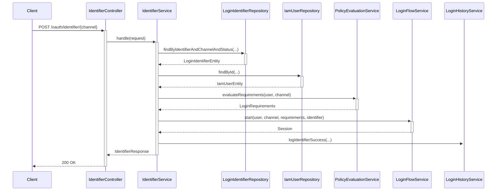
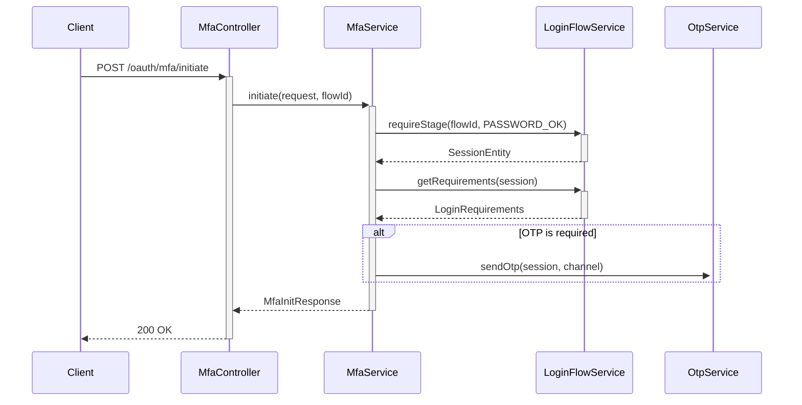
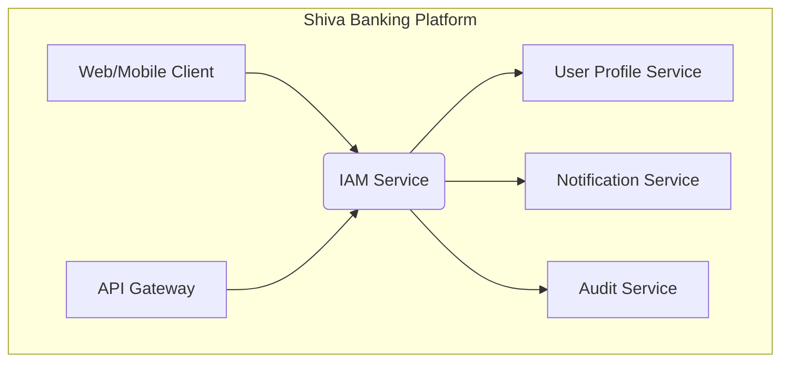
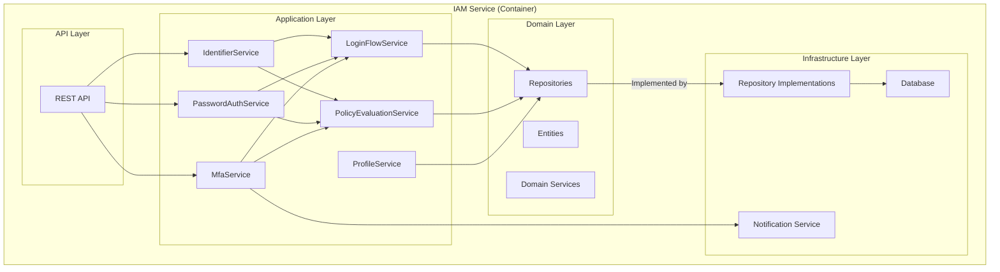

# IAM Service Documentation

## 1. Introduction

The IAM (Identity and Access Management) service is responsible for managing user identities and controlling access to resources within the Shiva Banking platform. It handles user authentication, authorization, and profile management.

## 2. Architecture

The service is a Spring Boot application that follows a Domain-Driven Design (DDD) approach. The code is organized into modules, with the core logic residing in the `iam` module.

### 2.1. Package Structure

The `iam` module is structured as follows:

-   `api`: Contains the REST controllers that expose the service's functionality.
-   `app`: Contains the application services that orchestrate the business logic.
-   `domain`: Contains the domain models, repositories, and domain services.
-   `infra`: Contains the infrastructure-related code, such as repository implementations.

### 2.2. Authentication Flow

The authentication flow is channel-based. The service supports the following channels:

-   Internet Banking
-   Mobile Banking
-   Backoffice
-   Agent App
-   Merchant Portal
-   API Access
-   USSD

The authentication process starts with the `IdentifierController`, which identifies the user based on their credentials for a specific channel. The `IdentifierService` then handles the user identification process.

#### User Identification Flow

The `IdentifierService.handle` method performs the following steps:

1.  **Find Identifier**: It searches for a `LoginIdentifierEntity` that matches the provided identifier, channel, and has an `ACTIVE` status.
2.  **Handle Not Found**: If the identifier is not found, it logs the failure and returns an `Unauthorized` error.
3.  **Check User Status**: It verifies that the associated `IamUserEntity` is `ACTIVE`. If not, it logs the failure and returns an `Unauthorized` error.
4.  **Evaluate Policies**: It uses the `PolicyEvaluationService` to determine the login requirements for the user and channel (e.g., password, OTP, TOTP).
5.  **Start Login Flow**: It initiates a new login flow by calling the `LoginFlowService`, which creates a temporary session.
6.  **Log Success**: It logs the successful identifier verification.
7.  **Return Response**: It returns an `IdentifierResponse` containing a `flowId` and the specific login requirements.



## 3. API Endpoints

The following are the main API endpoints exposed by the service:

### 3.1. Authentication

-   `POST /oauth/identifier/backoffice`: Identify a user for the Backoffice channel.
-   `POST /oauth/identifier/mobile`: Identify a user for the Mobile Banking channel.
-   `POST /oauth/identifier/internet-banking`: Identify a user for the Internet Banking channel.
-   `POST /oauth/identifier/ussd`: Identify a user for the USSD channel.
-   `POST /oauth/password`: Submit a password for authentication.
-   `POST /oauth/mfa/initiate`: Initiate the MFA process.
-   `POST /oauth/mfa/verify`: Verify the MFA code.

*Further documentation on other controllers and endpoints will be added here.*

### 3.2. Password Authentication Flow

After the user has been identified, the client submits the user's password to the `/oauth/password` endpoint. The `PasswordAuthService` then handles the password verification process.

#### Password Verification Flow

The `PasswordAuthService.handle` method performs the following steps:

1.  **Load Session**: It retrieves the current login session using the `flowId` and verifies that the current stage is `IDENTIFIER_OK`.
2.  **Verify Password**: It uses the `PasswordVerifier` to check the provided password against the user's stored credentials.
3.  **Handle Failure**: If the password is incorrect, it records a `LOGIN_FAILURE` event, logs the failure, and returns an `Unauthorized` error.
4.  **Handle Success**: If the password is correct, it records a `LOGIN_SUCCESS` event and logs the success.
5.  **Get Requirements**: It retrieves the remaining login requirements from the session metadata.
6.  **Advance Stage**: It updates the login stage to `PASSWORD_OK` and extends the session's validity.
7.  **Return Response**: It returns a `PasswordStepResponse` containing the `flowId` and the next set of login requirements (e.g., OTP, TOTP).

```mermaid
sequenceDiagram
    participant Client
    participant PasswordAuthController
    participant PasswordAuthService
    participant LoginFlowService
    participant PasswordVerifier
    participant SecurityEventService
    participant LoginHistoryService

    Client->>+PasswordAuthController: POST /oauth/password
    PasswordAuthController->>+PasswordAuthService: handle(request, flowId)
    PasswordAuthService->>+LoginFlowService: requireStage(flowId, IDENTIFIER_OK)
    LoginFlowService-->>-PasswordAuthService: SessionEntity
    PasswordAuthService->>+PasswordVerifier: verify(session, password)
    alt Password is valid
        PasswordVerifier-->>-PasswordAuthService: true
        PasswordAuthService->>+SecurityEventService: onLoginSuccess(...)
        PasswordAuthService->>+LoginHistoryService: logPasswordSuccess(...)
        PasswordAuthService->>+LoginFlowService: updateStage(session, PASSWORD_OK)
        PasswordAuthService->>+LoginFlowService: extend(session)
        PasswordAuthService-->>-PasswordAuthController: PasswordStepResponse
        PasswordAuthController-->>-Client: 200 OK
    else Password is invalid
        PasswordVerifier-->>-PasswordAuthService: false
        PasswordAuthService->>+SecurityEventService: onLoginFailure(...)
        PasswordAuthService->>+LoginHistoryService: logPasswordFailure(...)
        PasswordAuthService-->>-PasswordAuthController: Unauthorized Exception
        PasswordAuthController-->>-Client: 401 Unauthorized
    end
```

### 3.3. MFA Flow

After successful password authentication, the client may need to perform Multi-Factor Authentication (MFA). The MFA flow consists of two steps: initiation and verification.

#### MFA Initiation Flow

The `MfaService.initiate` method performs the following steps:

1.  **Load Session**: It retrieves the current login session and verifies that the current stage is `PASSWORD_OK`.
2.  **Get Requirements**: It retrieves the login requirements from the session metadata.
3.  **Handle TOTP**: If TOTP is required, the service does nothing. The client is expected to have the TOTP secret.
4.  **Handle OTP**: If OTP is required, it calls the `OtpService` to send a one-time password to the user.
5.  **Return Response**: It returns an `MfaInitResponse` containing the `flowId`.



#### MFA Verification Flow

The `MfaService.verify` method performs the following steps:

1.  **Load Session**: It retrieves the current login session and verifies that the current stage is `PASSWORD_OK`.
2.  **Get Requirements**: It retrieves the login requirements from the session metadata.
3.  **Verify Code**: It verifies the provided MFA code. If TOTP is required, it uses the `TotpVerifier`; otherwise, it uses the `OtpService`.
4.  **Handle Failure**: If the code is invalid, it records a `LOGIN_FAILURE` event, logs the failure, and returns a `Bad Request` error.
5.  **Handle Success**: If the code is valid, it records a `LOGIN_SUCCESS` event and logs the success.
6.  **Advance Stage**: It updates the login stage to `MFA_OK` and extends the session's validity.
7.  **Return Response**: It returns an `MfaVerifyResponse` containing the `flowId` and a flag indicating whether profile selection is the next step.

```mermaid
sequenceDiagram
    participant Client
    participant MfaController
    participant MfaService
    participant LoginFlowService
    participant TotpVerifier
    participant OtpService
    participant SecurityEventService
    participant LoginHistoryService

    Client->>+MfaController: POST /oauth/mfa/verify
    MfaController->>+MfaService: verify(request, flowId)
    MfaService->>+LoginFlowService: requireStage(flowId, PASSWORD_OK)
    LoginFlowService-->>-MfaService: SessionEntity
    MfaService->>+LoginFlowService: getRequirements(session)
    LoginFlowService-->>-MfaService: LoginRequirements
    alt TOTP is required
        MfaService->>+TotpVerifier: verify(user, code)
        TotpVerifier-->>-MfaService: boolean
    else OTP is required
        MfaService->>+OtpService: verify(flowId, code)
        OtpService-->>-MfaService: boolean
    end
    alt Code is valid
        MfaService->>+SecurityEventService: onLoginSuccess(...)
        MfaService->>+LoginHistoryService: logMfaSuccess(...)
        MfaService->>+LoginFlowService: updateStage(session, MFA_OK)
        MfaService->>+LoginFlowService: extend(session)
        MfaService-->>-MfaController: MfaVerifyResponse
        MfaController-->>-Client: 200 OK
    else Code is invalid
        MfaService->>+SecurityEventService: onLoginFailure(...)
        MfaService->>+LoginHistoryService: logMfaFailure(...)
        MfaService-->>-MfaController: Bad Request Exception
        MfaController-->>-Client: 400 Bad Request
    end
```

## 4. Domain Model

The domain model is organized into several packages, each representing a specific area of the domain.

### 4.1. Entities

-   **`auth`**: Contains entities related to authentication.
    -   `CustomerAuthEntity`
    -   `EmployeeAuthEntity`
    -   `OrganizationUserAuthEntity`
-   **`identity`**: Contains entities related to user identity.
    -   `IamUserEntity`
    -   `LoginIdentifierEntity`
    -   `RefreshTokenEntity`
    -   `SessionEntity`
    -   `UserContact`
-   **`policy`**: Contains entities related to policies.
    -   `FeaturePolicyEntity`
    -   `MfaPolicyEntity`
    -   `PasswordPolicyEntity`
    -   `PinPolicyEntity`
    -   `PolicyEntity`
    -   `SecurityQuestionPolicyEntity`
-   **`profile`**: Contains entities related to user profiles.
    -   `CustomerProfileEntity`
    -   `EmployeeProfileEntity`
    -   `OrganizationEntity`
    -   `OrganizationUserEntity`
    -   `PartyEntity`
    -   `PersonEntity`
    -   `ProfileContact`
-   **`rbac`**: Contains entities related to Role-Based Access Control (RBAC).
    -   `EmployeePermissionEntity`
    -   `EmployeeProfileRoleEntity`
    -   `EmployeeRoleEntity`
    -   `EmployeeRolePermissionEntity`
    -   `OrgRoleEntity`
    -   `OrgRolePermissionEntity`
    -   `OrgUserRoleEntity`
-   **`security`**: Contains entities related to security.
    -   `IamUserSecurityQuestionEntity`
    -   `OtpRecordEntity`
    -   `RevokedTokenEntity`
    -   `SecurityChallengeAttemptEntity`
    -   `SecurityEventEntity`
    -   `SecurityQuestionEntity`
    -   `TrustedDeviceEntity`
    -   `UserConsentEntity`
-   **`system`**: Contains system-level entities.
    -   `ClientCredentialEntity`
    -   `FeatureEntity`

*Further details on the domain model will be added here.*

## 6. Request Signatures

Some endpoints in the IAM service require a request signature for an additional layer of security. This is handled by the `RequestSignatureFilter`.

### 6.1. How it Works

The filter intercepts incoming requests and checks for the `@RequireSignature` annotation on the controller method. If the annotation is present, it validates the signature provided in the `X-Signature` header.

### 6.2. Generating the Signature

To generate a valid signature, you need to follow these steps:

1.  **Get the current Unix timestamp**: This will be the value of the `X-Timestamp` header.
2.  **Construct the payload string**: The payload is a concatenation of the HTTP method, the request URI, and the timestamp, separated by a pipe character (`|`).

    ```
    payload = <HTTP_METHOD> + "|" + <REQUEST_URI> + "|" + <TIMESTAMP>
    ```

    For example:
    ```
    payload = "POST|/oauth/identifier/mobile|1672692000"
    ```

3.  **Compute the HMAC-SHA256 hash**: Compute the HMAC-SHA256 hash of the payload string using the secret key configured in the service.
4.  **Base64 encode the hash**: Base64 encode the resulting hash. This will be the value of the `X-Signature` header.

### 6.3. Sending the Request

Include the following headers in your request:

-   `X-Timestamp`: The Unix timestamp used to generate the signature.
-   `X-Signature`: The Base64 encoded HMAC-SHA256 signature.

**Note**: The signature is valid for a limited time (default is 5 minutes) to prevent replay attacks.

## 5. Diagrams

*(Mermaid diagrams will be added here to visualize the architecture and flows.)*

### System Context Diagram



### Architecture Diagram



